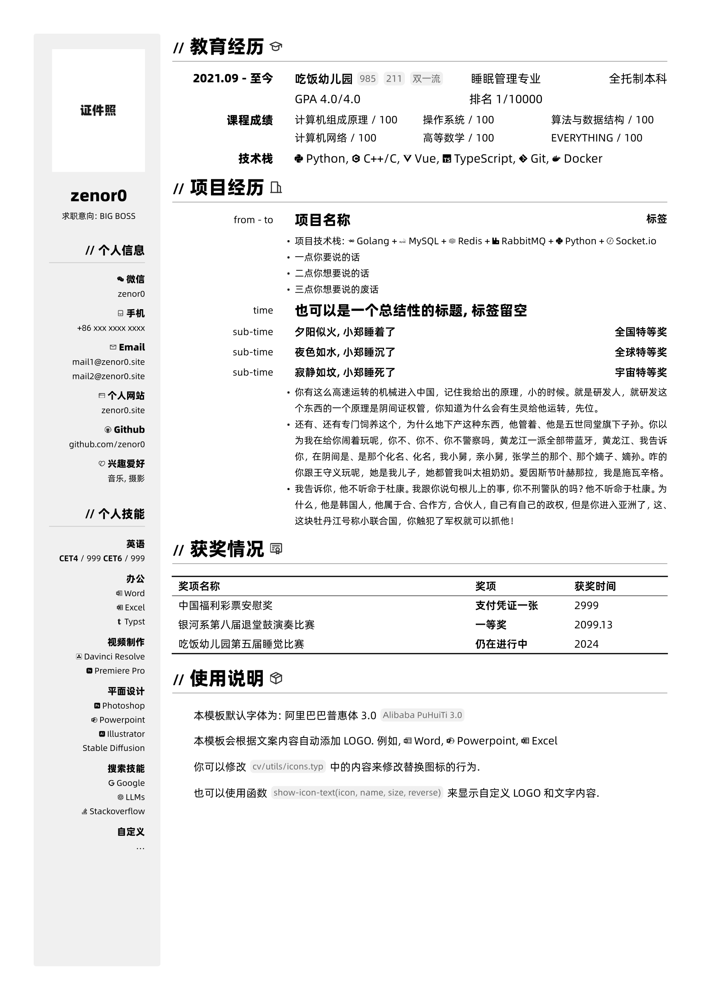

# SIMPLE-NEAT-CV

这是个人自用的一个 Typst 简历模板

## 预览



## 使用

> [!NOTE]
> 使用前请确保你的系统上已经安装了 `typst` 以及你的系统中安装了 阿里巴巴普惠体3.0 字体

首先请克隆本仓库

```bash
git clone
```


### 本地使用

> [!NOTE]
> WIP, 这个方法不一定在所有系统上正常工作.
执行

```bash
make
```

若指令工作正常, 应该会将本模板加入到 typst 包管理器中.

此时你可以通过 `@local/simple-neat-cv:0.1.0` 来访问本模板.

运行 `typst init @local/simple-neat-cv:0.1.0` 即可初始化一个简历项目.

### 在线使用


> [!NOTE]
> WIP

## LICENSE

本项目基于 MIT 协议开源, 欢迎二次开发

项目中的图标来源于 [simpleicons](https://simpleicons.org/) 和 [iconpark](https://iconpark.oceanengine.com/)